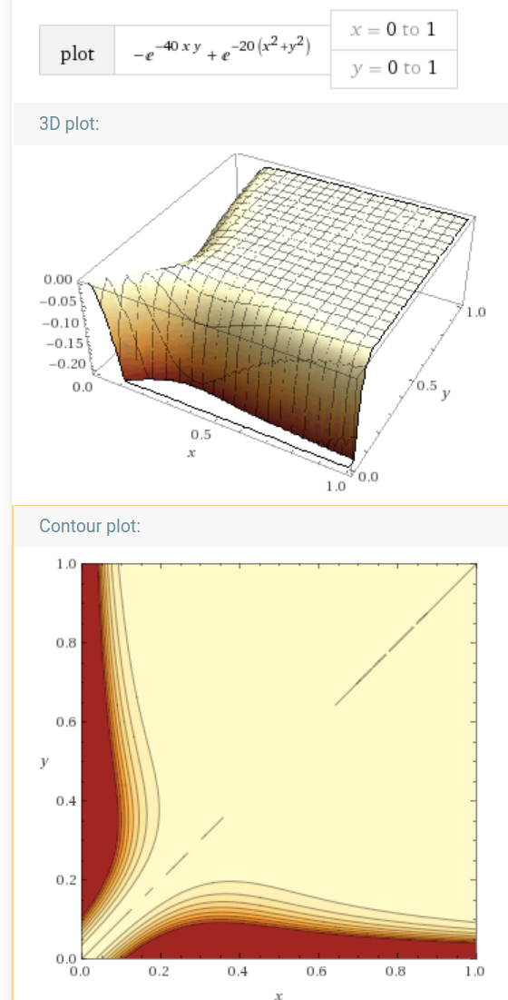
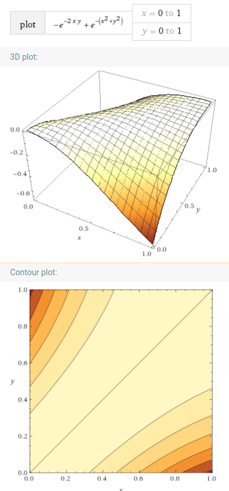

# Neuromancer --- a permutation-invariant ANN module

## Acknowledgement

The genetic algorithm for evolving neural networks is adopted from the Github [NeuralGenetic](https://github.com/ahmedfgad/NeuralGenetic) repository by Ahmed Fawzy Gad.   He has written a detailed tutorial about this technique.

## Running

Requires `Python 3`, `numpy`, and `pickle`, also:

    pip3 install matplotlib
    
 To execute:
 
     python3 evolve_Neuromancer.py

## Parameters

In file `evolve_Neuromancer.py`:

* `num_generations`

* `method` can be "sigmoid" or "ReLU" 

* **topology of the ANN** is defined in the beginning section, `HL1_neurons`,  etc...

In file `ANN.py`:

* N = dimension of input / output vectors of the ANN

* in function `joint_penalty`, k = "steepness" can be adjusted from 1.0 to > 30.0

## About the loss function

The **set distance** d(X, Y) must satisfy 2 requirements simultaneously:

1. The distance should be 0 if Y and Y are permutations of each other

2. The distance attains its maximum when X and Y are most dissimilar, and this maximum would equal the Euclidean distance between them.

The **joint penalty** is calculated from d1 and d2 where d1 is the **set** distance between 2 input points X1 and X2, and d2 is the **Euclidean** distance between the corresponding output points Y1 and Y2.

In other words, the ANN sends X1 to Y1 and sends X2 to Y2.

d1 is the distance between X1 and X2.

d2 is the distance between Y1 and Y2.

The final loss function is given by the **joint penalty** with formla given in the figures below, where x and y refer to the distances d1 and d2.

The "steepness" of the joint penalty can be adjusted.  Here is a plot of a very steep (steepness = 20) joint penalty:

 

Notice that the red color represents regions that should be penalized.  They occur when the input distance is big but the output distance is small, or vice versa.  Otherwise the penalty is close to zero (white color), so the ANN is free to map input points "anywhere" into the white regions.

Here is the plot where steepness is 1:

 

This is not very useful for our purpose, but is included here for comparison.